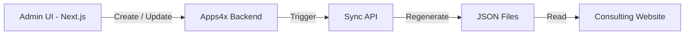

# Mawarid Consulting

## Project Overview: New UI in Next.js with Apps4x Backend

### Backend: Apps4x Platform

The backend is managed using **Apps4x**, including:

- **Entities, Forms, and Events** configuration
- Application: **Mawarid Consulting**
- Role-based **Menu with Permissions**
- **Login, User Permissions, and Dynamic Menu Management** handled in the **MWD Consulting Portal App**

The backend controls:

- Authentication and authorization
- User role-based access
- Menu visibility based on permissions
- Entity operations (Create, Update, Delete, View)
- Event handling

---

### Frontend: Next.js Application

A new UI is developed using **Next.js** with the following setup:

- All pages are dynamically configured based on Apps4x backend entities.
- The frontend primarily supports:
  - Data viewing
  - Triggering actions (Create, Update, Delete, etc.)
- The application does not manage business logic locally — it relies entirely on Apps4x APIs.

---

### Data Synchronization

- All data from the Next.js app is connected to the Consulting Website.
- Any Create or Update action in the Next.js app automatically triggers synchronization.
- A centralized sync mechanism ensures data consistency between:
  - Apps4x backend
  - Next.js frontend
  - Consulting website

---

### Sync APIs

- Sync APIs call Next.js API routes.
- These APIs refresh and regenerate website JSON data.
- The website always displays updated and synchronized content.

---

## Admin Portal

**Live URL:** [https://portal.mawarid.com.sa/mawarid-consulting](https://portal.mawarid.com.sa/mawarid-consulting)

The Admin UI application (`mawarid-consulting`) is deployed on:

| Property | Value |
|---|---|
| Server IP | `172.16.1.109` |
| Server Location | `E:\IISApplication\App\mawarid-consulting` |

This application is used for:

- Login and role-based permissions
- Menu access control
- Managing entities (Create / Update / Delete)
- Triggering Sync APIs

---

## Consulting Website

**Live URL:** [https://consulting.mawarid.com.sa/](https://consulting.mawarid.com.sa/)

The Consulting Website is deployed on:

| Property | Value |
|---|---|
| Server IP | `20.67.86.148` |
| Server Location | `C:\inetpub\wwwroot\ConsultingWebsite` |

---

## Data Flow and JSON Sync Process

The Consulting Website does **not** directly fetch data from the backend (Apps4x).

Instead:

- Pages like **Services**, **Library**, and **Events** read data from local JSON files.
- When any Create or Update action is performed in the Admin UI:

  1. The backend API processes the data.
  2. A **Sync API** is triggered.
  3. The JSON files are regenerated.
  4. Existing JSON files are replaced with updated data.
  5. The website automatically reflects the updated content.

---

## Benefits of This Setup

| Benefit | Description |
|---|---|
| Reduced API calls | Website reads local JSON — no live backend queries |
| Lower server load | No repeated DB calls on every page view |
| Improved performance | Faster page loading from static JSON data |
| Controlled sync | Data updates only when explicitly triggered |
| Consistency | Single sync mechanism keeps all layers in sync |

---

## Project Details

Mawarid Consulting developed UI in React and used apps4x as a backend

| Field | Details |
|---|---|
| **URL** | [https://portal.mawarid.com.sa//mawarid-consulting](https://portal.mawarid.com.sa//mawarid-consulting) |
| **Swagger URL** | [https://portal.mawarid.com.sa/apps4x-api/swagger/index.html](https://portal.mawarid.com.sa/apps4x-api/swagger/index.html) |
| **Deployment Server** | `172.16.1.109` |
| **API Path** | `E:\IISApplication\apps4x-api` |
| **UI Path** | `E:\IISApplication\App\mawarid-consulting` |
| **DB Server** | `172.16.1.109` |
| **DB Name** | `MWDApps4xPlat`, `MWDApps4xData` |
| **Resources** | Ishanullah, Mohamed Aalith |
