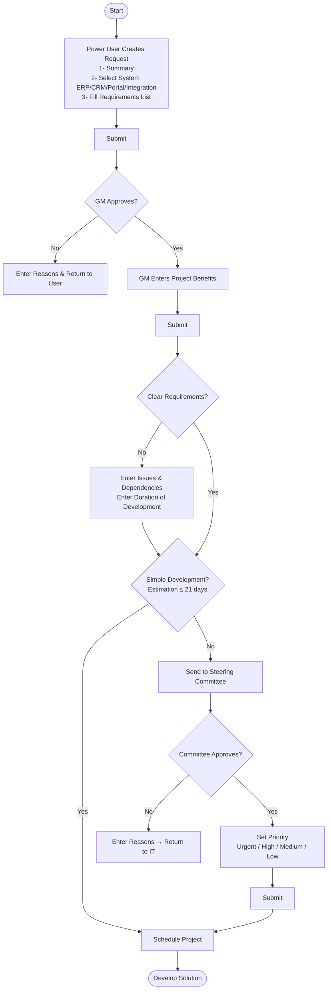

# SDR — Software Development Request

The **SDR** module allows end users (Power Users) to submit requests for new features or change requests to existing systems. Each request follows a structured review and approval workflow before development begins.

## Request Form

When creating a request, the requester fills in the following:

**Filled by Requester:**
| Field | Description |
|---|---|
| **Category** | Select one or more systems: ERP / CRM / Portal / Integration |
| **Summary** | Free text description of the requested feature or change |
| **Requirements List** | User stories in format: *As a [role], I want [feature], So that [benefit]*, with a Priority value |

**Filled by General Manager (after GM approval):**
| Field | Description |
|---|---|
| **Project Benefits** | Legal, Financial, and other business benefit details |

---

## Request Status Flow

---

## Request Statuses

| Status | Description |
|---|---|
| **Draft** | Request created but not yet submitted |
| **General Manager Approval** | Submitted and awaiting GM approval |
| **IT Review** | GM approved; IT team reviewing and estimating |
| **Steering Committee** | Estimation > 21 days; awaiting committee approval |
| **Approved** | Approved and project created |
| **Rejected** | Rejected by GM or Steering Committee |
| **Completed** | Development done and project marked complete |
| **Hold** | Project placed on hold |

---

## Pages

| Section | Page |
|---|---|
| [My Request](./my-request) | End user's submitted requests |
| **IT** | |
| [IT — Requests](./it/requests) | IT view: Pending and All requests |
| [IT — Projects](./it/projects) | IT view: Pending / Completed / All projects |
| [IT — Tasks](./it/tasks) | IT view: Pending / Completed / All tasks |
| **Steering Committee** | |
| [Steering Committee — Pending Approvals](./steering-committee/pending-approvals) | Requests awaiting committee decision |
| [Steering Committee — All Projects](./steering-committee/all-projects) | All projects reviewed by committee |
| **Approvals** | |
| [Approvals](./approvals) | GM approval queue: Pending / Completed / All |

---

## Project Details

SDR developed under Apps4x - apps

| Field | Details |
|---|---|
| **URL** | [https://portal.mawarid.com.sa/apps4x/#/apps/SoftwareDevelopmentRequest](https://portal.mawarid.com.sa/apps4x/#/apps/SoftwareDevelopmentRequest) |
| **Swagger URL** | [https://portal.mawarid.com.sa/apps4x-api/swagger/index.html](https://portal.mawarid.com.sa/apps4x-api/swagger/index.html) |
| **Deployment Server** | `172.16.1.109` |
| **API Path** | `E:\IISApplication\apps4x-api` |
| **UI Path** | `E:\IISApplication\App\apps4x` |
| **DB Server** | `172.16.1.109` |
| **DB Name** | `MWDApps4xPlat`, `MWDApps4xData` |
| **Resources** | AjeeshNasar, HyderAli |
